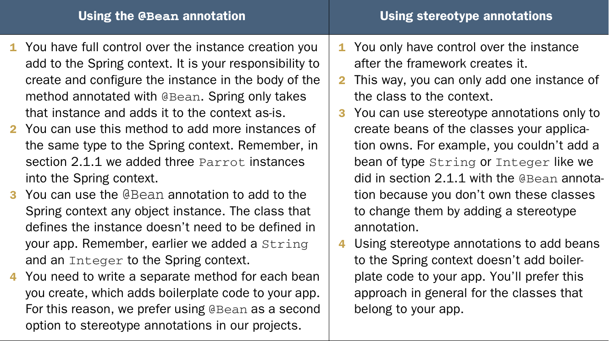

# Chapter 2: The Spring Context: Defining Beans

## What Is the Spring Context:
- The spring inversion of control container (aka the spring context) is the container to which we add our object instances in order to make spring aware of their existence and manage them.
- By making spring manage the instances we allow it to provide the object with functionalities the framework provides and allow spring to inject the objects when creating them

## Ways of adding instances to context

### 1. Through the `@Beans` annotation
1- create a config class that is used by the context container to know how to behave (alternative to XML config) and annotate it with `@Configuration`
```java
@Configuration
public class ProjectConfig{

}
```
2- Add each required bean as a function that returns an instance of the bean and annotate each of these functions with `@Bean`
```java
@Configuration
public class ProjectConfig{
    @Bean
    Parrot parrot(){
        Parrot p = new Parrot();
        p.setName("koko");
        return p;
    }
}
```

3- Create the context object and give in the constructor the context the config class
```java
public static void main(String[] args){
    var context = new AnnotationConfigApplicationContext(ProjectConfig.class);

    Parrot p = context.getBean(Parrot.class);
}
```
in the above examples we referred to the instance using its type because we only had one instance of that type in the context

we can add multiple instances of the same type using `@Bean` as follows

```java
public class ProjectConfig{
    @Bean
    Parrot parrot1(){
        Parrot p = new Parrot();
        p.setName("koko");
        return p;
    }

    Parrot parrot2(){
        Parrot p = new Parrot();
        p.setName("kiki");
        return p;
    }
}
```
the method names become the identifiers of the instances in the container and instances can be accessed as follows
```java
public static void main(String[] args){
    var context = new AnnotationConfigApplicationContext(ProjectConfig.class);

    Parrot p = context.getBean("parrot2",Parrot.class);
}
```
1- the first argument is the name of the instance (by default it's the name of the function annotated by`@Bean`)
2- the second argument is the class that specifies the type of the instance

### 2. Through stereotype annotations 
we can also add instances to the context using the `@Component` annotation

1- we will create a config class just like in `@Bean` method, but we will not add the instances themselves inside the class but instead tell spring where to look for classes needed for inclusion using the `@ComponentScan` annotation

```java
@Configuration
@ComponentScan(basePackages = "main")
public class ProjectConfig {
}
```
this tells spring to look for annotated classes to instantiate INT the context inside the main package

2- annotate the desired classes with `@Component` to tell spring to create an instance of that class and put it in context
```java
@Component
public class Parrot{
    private String name;
    
    public String getName(){
        return name;
    }

    public void setName(String name){
        this.name = name;
    }
}
```

3- create an instance of the context and supply it with the config class
```java
public static void main(String[] args){
    var context = new AnnotationConfigApplicationContext(ProjectConfig.class);

    Parrot p = context.getBean(Parrot.class);
    System.out.println(p.getName);
}
```
**VIP NOTE:** 
- the last line of the above code prints null as by using the `@Component` annotation spring simply creates an instance, and we have no way to configure the instance before it's creation and so the `setName()` method was never called

- to fix this we can annotate a method inside the component with `@PostConstruct` which will be executed right after spring finishes creating the instance

```java
@Component
public class Parrot{
    private String name;
    
    public String getName(){
        return name;
    }

    public void setName(String name){
        this.name = name;
    }

    @PostConstruct
    public void init() {
        this.name = "Kiki";
    }
}
```

the above code will execute `init()` after creating an instance of parrot and so code in point 3 will print `kiki` 

### 3. Programmatically
sometimes the need may arise where we need to add a specific instance to the context based on for example configurations provided by the user

in this case we can add instances programmatically as follows

1- create a config class. However, for this method we shall leave it empty

2- create context and provide it with config class

3- create the instances and add them to the context. The function required for doing so is `regisetBean()` and it takes the following arguments `String beanName`
```java
Class<T> beanClass,
Supplier<T> supplier,
BeanDefinitionCustomizer... customizers
```

```java
public static void main(String[] args) {
var context = new AnnotationConfigApplicationContext (ProjectConfig.class);

Parrot x = new Parrot();
x.setName("Kiki");

Supplier<Parrot> parrotSupplier = () -> x;

context.registerBean("parrot1",
Parrot.class, parrotSupplier);
}
```

## comparison between using `@Beans` and using stereotype annotation
