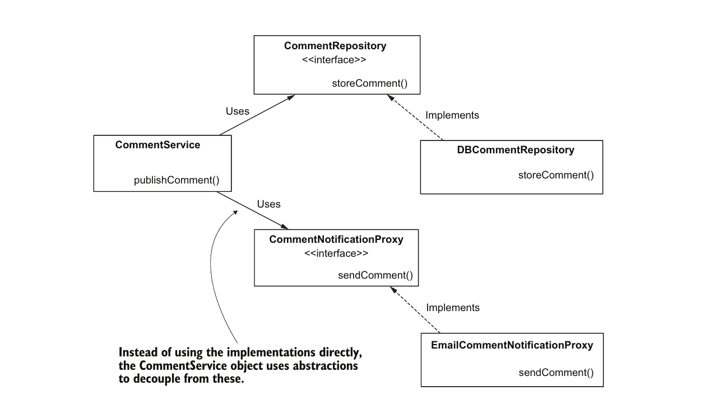
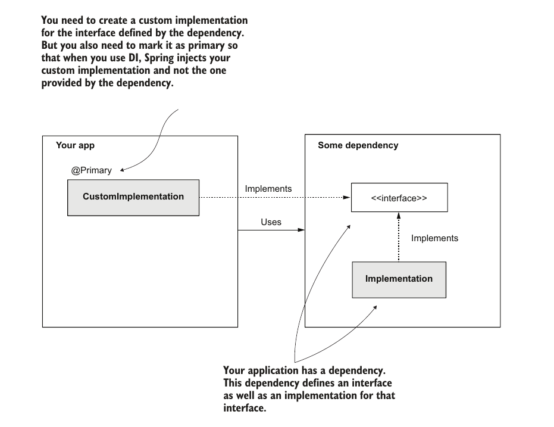

# Chapter 4: The Spring Context: Using Abstractions

- In this chapter we deal with using abstractions with Spring
- The abstractoins we deal with are interfaces
- We will not cover what interfaces are or how we use them to decouple code this knowledge is assumed 
- Throughout this chapter we will use the following desing to explain how to use spring with intefaces


## Adding Classes That Use Abstraction To the Context

- any of the methods discussed in chapter two can be used to add classes such as `CommentService` to the context
- Spring is smart enought to understand that when you use a inteface type, it should look for an instance that implements that interface and inject it for you
- The deciding factor in this example of whether to add a certain instance to the context or not is whether we need spring to inject dependencies or not. So in this case we will add all objects that have dependencies and all objects that are dependencies themselves.
- Adding something to the context means that we need spring to instantiate an instance of the class and manage it so we never add intefaces or abstract classes to the context as we can never make an instance of those
- We use Spring's DI capabilities in this case to reduce boiler plate code required for createing and connected all of these dependencies together.

## Choosing Between Multiple Beans Implementing The Same Inteface

### 1. Using `@Primary` annotation
- This is the same method we used in chapter 3.

- You might ask why do we have multiple implementations in the first place if we are going to always choose one of them to inject. This method could be handy when we use a dependency that provides both an interface and an implementation for this interface, and we want to use our own custom implementation. Because we do not have access to the source code of the dependency, using `@Primary` on our implementation will instruct Spring to use this instead of the implementation provided by the dependency. This situation is illustrated in the following figure.



### 2. Using `@Qualifier` Annotation

- The `@Qualifier` annotations can be used on the different implementations to give them a qualifier
- The `@Qualifier` annoations can then be used in the points of injection to specify which implementations is required
```java
@Component
@Qualifier("PUSH")
public class CommentPushNotificationProxy implements CommentNotificationProxy {
    // Omitted code
}
#########################################
@Component
@Qualifier("EMAIL")
public class EmailCommentNotificationProxy implements CommentNotificationProxy {
    // Omitted code
}
#########################################
@Component
public class CommentService {
    private final CommentRepository commentRepository;
    private final CommentNotificationProxy commentNotificationProxy;

    public CommentService(
    CommentRepository commentRepository,
    @Qualifier("PUSH") CommentNotificationProxy commentNotificationProxy) {
        this.commentRepository = commentRepository;
        this.commentNotificationProxy = commentNotificationProxy;
    }

    // Omitted code
}
```
in the above code the `@Qualifier` annotaion was used on the implementations to allow us to identify them and then used again in the point of injection to specify which instance in the context is to injcted

## Specifing Object Responsibility Using Stereotype Annotaions
- The `@Component` annoations is a member of a type of annoations called stereotype annoations, these annoations specify that Spring should create a bean of this class and place it in context.
- Stereotype annotations add instances to the context but different ones exist in order to specify what the class is suposed to and improve readability
- `@Component` is a generic stereotype we use when spring doens't provide an annotations that describes the responsibility of the class
- Other Stereotype annotations include
    - `@Service`: For componentes that take the responsibility of a service
    - `@Respository`: For componentes that take the role of a respository (such as DB access) 
