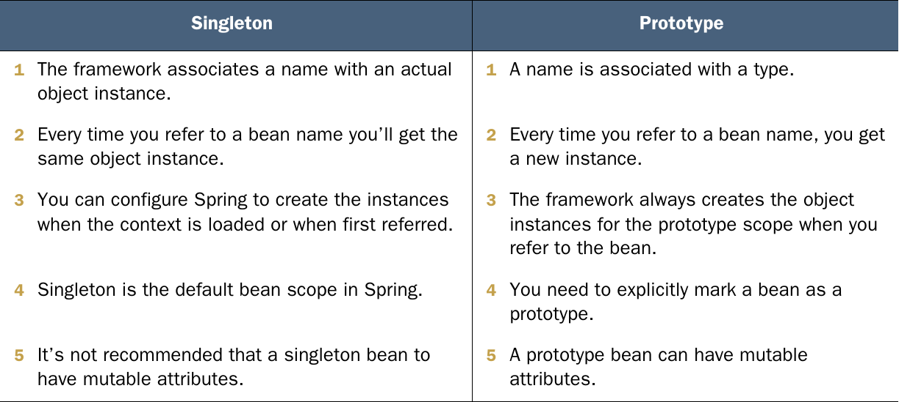

# Chapter 5: The Spring Context: Bean Scopes and lifecycle

- In the world of Spring, a bean scope refers to a certain approach for spring to create and manage beans
- In this chapter we will discuss two scopes which are the singleton scope and prototype scope
- There are other scopes that shall be discussed later

## 1. Singleton Scope
- The singleton scope is the default scope and is what we have been dealing with up until this point
- Note that this scope is different from the singleton design pattern. In the design pattern the entire program would have one unique instance of the type designed as a singleton; however, in this scope the program could have multiple instance of the same type and singleton here refers to the fact that each unique name refers to a unique instance
- Whenever a bean with a certain name is referenced, the context returns the same instance every single time for Singleton beans.
- Because the same instance is always returned if multiple threads try to use the bean, the bean either needs to implement a way to synchronize threads or the bean should be immutable in order to avoid race conditions


Singleton beans can be instantiated in one of two method

### 1.1 Using eager instantiation

- Eager instantiation is the default behavior for instantiating Singleton beans
- In this behavior the bean get instantiated when the context is created

### 1.2 Using lazy instantiation

- In lazy Instantiations the bean is not created when the context is created but instead, each bean is created the first time the bean is referenced 
- A lazily initialized bean is declared as follows

```java
@Service
@Lazy
public class CommentService {
    public CommentService() {
    System.out.println("CommentService instance created!");
    }
}
```
## 2. Prototype Scope

- With a type declared as a prototype, the context returns a **new instance** every time a reference to an object of that type is required

- Because a new instance is returned by the context every time, multiple threads can mutate the instance safely

- Be careful when injecting a prototype bean into a singleton bean because if the singleton bean is meant to be used concurrently this will cause a race condition to happen because the Singleton bean is initialized only once and so one instance of the prototype bean is being used over and over. Instead, Inject the context into the Singleton bean and retrieve the prototype from the context so that every time the bean is required a new instance is returned

- A bean can be declared as prototype scoped as using the `@Scope` annotations as follows
```java
@Component
@Scope(BeanDefinition.SCOPE_PROTOTYPE)
public class CommentProcessor {
    @Autowired
    private CommentRepository commentRepository;
    // Omitted code
}
```
*note: the author of the book's opinion about prototype beans and mutable types is that they should be generally avoided when possible*

The following is a comparison between prototype and singleton beans


