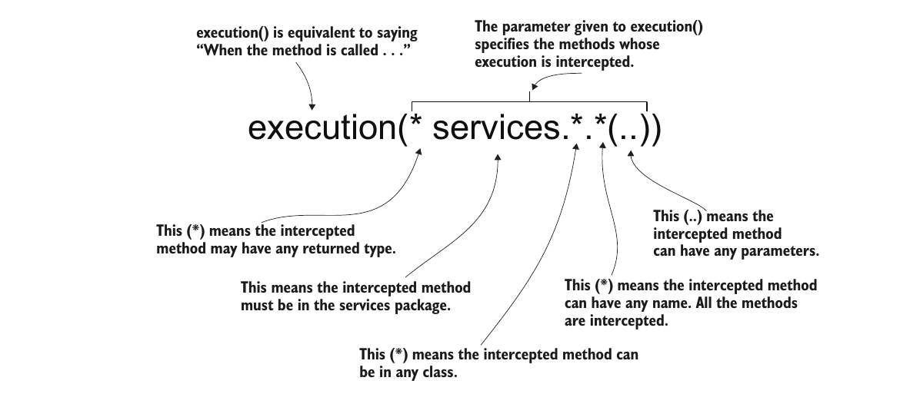

# Chapter 6: Using Aspects With Spring AOP

- In this chapter we learn about spring aspects
- An aspect is a piece of code/logic that is executed when another method is executed

## Terminology & Concepts

- Aspect: The code you want to execute when a specific method is called
- Advice: When the logic of the aspect should be executed (after or before the method for example)
- Pointcut: Which method should the aspect intercept

- When we create an aspect for a method that belongs to a class (for example class `foo`), and then we get an instance of this class from the context, what spring returns is not an instance of the original class `foo` but instead an instance of an augmented class that we call a *proxy object*. 

- when calling the method we created an aspect for from the proxy object, we think we are calling the original function, but what happens is that the proxy object will execute the aspect logic and then delegate the rest of the work to the original method. This is called *weaving*

## Implementing Aspects

- We will defer talking about how to specify pointcut for later and now focus on how to create an aspect and what can be done in it  

- Above exectuting logic when a method is called, aspects can alter the behaviour of the method by changing the arguments passed to the aspected method and changing its return value.

### 1. A basic aspect

- A basic aspect is implemented using the following steps:

- import the required dependencies and then 

1. enable aspects by annotating the configuration class with `@EnableAspectJAutoProxy`

```java
    @Configuration
    @ComponentScan(basePackages = "")
    @EnableAspectsJAutoProxy
    public class PorjectConfig{

    }
```

2. Create a new class, annotate it with the `@Aspect` annotation and add it to the context

```java
    @Aspect
    @Component
    public class ExampleAspect{

    }
```
- *note: annotating a class using `@Aspect` does NOT add it to the context so remember to add the class to the context*

3. Specify the pointcut (will be discussed later)

4. implement the aspect
    - The aspect method takes as a parameter an object of type `ProceedingJoinPoint` which represents the 
    intercepted method (or the next aspect in the aspect chain).
    - We can learn information about the intercepted method and delegate to it using the `ProceedingJoinPoint` object

    ```java
        @Aspect
        @Component
        public class ExampleAspect{
            //something that tell us what to intercept goes here
            public void aspecMethod(ProceedingJoinPoint joinPoint){
                //some code before the intercepted method
                joinPoint.proceed(); //delegating work to the intercepted method
                //some code after the intercepted method
            }
        }
    ```

### 2. Altrering parameters and return value of intercepted method

we can read and alter the arguments sent to the intercepted method as follows
```java
    @Aspect
    @Component
    public class ExampleAspect{
        //something that tell us what to intercept goes here
        public void aspecMethod(ProceedingJoinPoint joinPoint){
            Object [] args = joinPoint.getArgs(); //to read the arguments

            Comment comment = new Comment();
            comment.setText("some other text");
            Object [] newArgs = {comment};

            //returnedVal now stored the return value of the intercepted method
            //we have also changed the arguments passed to the intercepted method from the original arguments in args to the ones we created and stored in newArgs
            Object returnedVal = joinPoint.proceed(newArgs); 

            return "FILED" //now we have altered the return value of the intercepted method
        }
    }
```

## Specifing Pointcuts

- up until now we have ignored discussing how to specify what methods should our aspects intercept
- there are two ways to do this
    1. using `AspectJ` pointcut expressions
    2. using annotated methods
### 1. Using AspectJ

- AspectJ is way to express what methods the aspect is going to intercetp.
- The expressions can be very complex; however, in real life most AspectJ expressions are straight forward
- The following is an example of specifying the pointcut using AspectJ

```java
    @Aspect
    @Component
    public class ExampleAspect{

        @Around("execution(* services.*.*(..))")
        public void aspecMethod(ProceedingJoinPoint joinPoint){
            Object [] args = joinPoint.getArgs(); 

            Comment comment = new Comment();
            comment.setText("some other text");
            Object [] newArgs = {comment};

            Object returnedVal = joinPoint.proceed(newArgs); 

            return "FILED" 
        }
    }
```
- The annotations means that the aspect should intercept a method
    - with any return value
    - in the package `services`
    - in a class with any name
    - the method could be of any name
    - the method could have any arguments



### 2. Using annotated methods

- We can specify the method to intercpet by using user made annoations as follows:

1. Create an annoation
    - the `@Retention` specifies that the annoations should be intercepted at runtime because this is not the default

    - the `@Target` specifies that this annoations can only be applies to methods because annotaions can be applied to anything by default
```java
    @Retention(RetentionPolicy.RUNTIME)
    @Target(ElementType.METHOD)
    public @interface ToLog {
    }
```
2. Use the annoations
```java
    @Aspect
    @Component
    public class ExampleAspect{

        @Around("@annotation(ToLog)")
        public void aspecMethod(ProceedingJoinPoint joinPoint){
            Object [] args = joinPoint.getArgs(); 

            Comment comment = new Comment();
            comment.setText("some other text");
            Object [] newArgs = {comment};

            Object returnedVal = joinPoint.proceed(newArgs); 

            return "FILED" 
        }
    }
```
- `aspectMethod` will now intercpet any method annotated with the `@ToLog` annotation


## Aspect execution chains

- Up until now we have only considered the case when there is only one aspect intercpeting a method. But what happens when multiples aspects intercept the same method?

- when multiple aspects are defined to intercpet the same method, spring will apply the aspects in a random order by default
- If the order of aspect execution matters then we use the `@Order` annoations to specify the order where a smaller number means earlier execution


```java
    @Aspect
    @Component
    public class ExampleAspect1{
        @Around("@annotation(ToLog)")
        @Order(1)
        public void aspecMethodFirst(ProceedingJoinPoint joinPoint){
        }
    }
    public class ExampleAspect2{
        @Around("@annotation(ToLog)")
        @Order(2)
        public void aspecMethodSecond(ProceedingJoinPoint joinPoint){
        }
    }
```
- The above code ensures that `aspectMethodFirst` executes before `aspectMethodSecond` when a method annotated with `@ToLog` is called

## Other Advice Annotations

- the `@Around` annoations is one of many annotaions we use with aspects called advice annoations

- `@Around` allows us to execute the aspect before, after or even instead of the intercepted method
- There are other less powerful annotations used that allow the aspect to execute at only a specific advice
- These advise annoations are:
    - `@Before`: Calls the method defining the aspect logic before the execution of the intercepted method.

    - `@AfterReturning`: Calls the method defining the aspect logic after the method successfully returns, and provides the returned value as a parameter to the aspect method. The aspect method isn’t called if the intercepted method throws an exception.
    - `@AfterThrowing`: Calls the method defining the aspect logic if the intercepted method throws an exception, and provides the exception instance as a parameter to the aspect method.
    - `@After—Calls`: the method defining the aspect logic only after the intercepted method execution, whether the method successfully returned or threw an exception.

