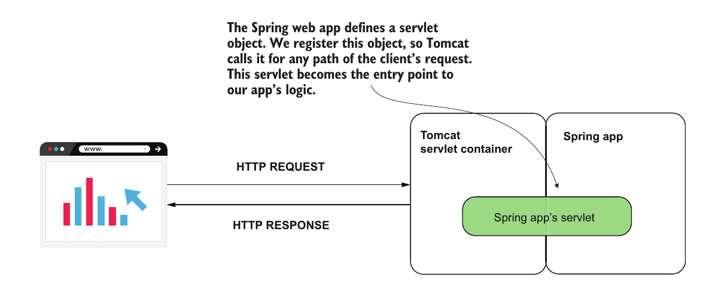
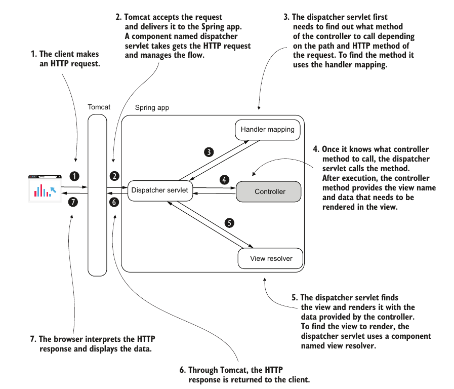
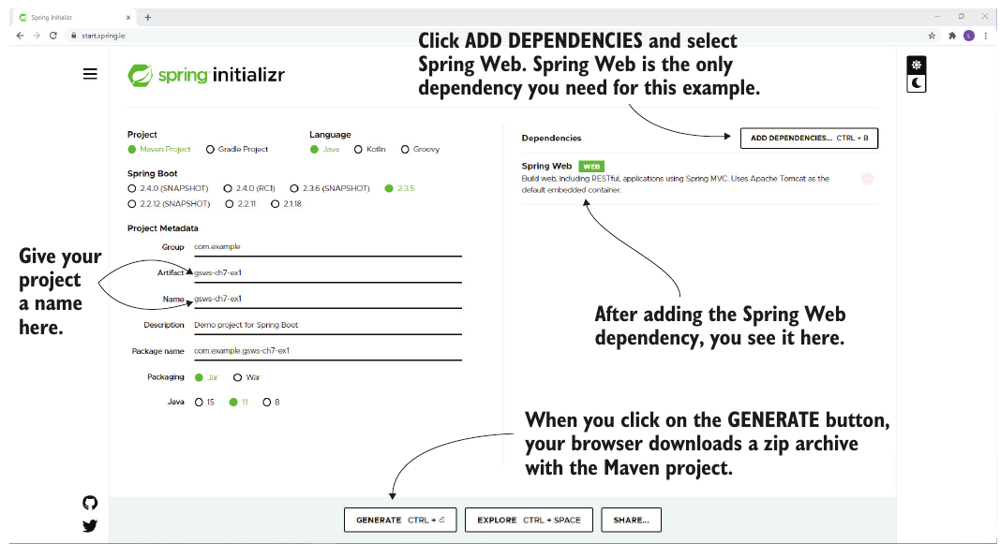
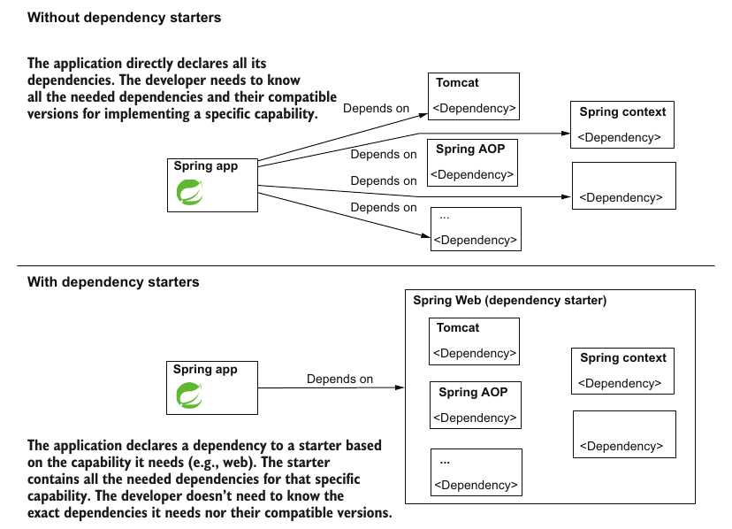

# Chapter 7: Understanding Spring Boot and Spring MVC

## What Is a Web App

- Back in the day to use an application, we had to install the application's binaries on our machine but now things are different

- Many of the apps we use now are accessable through the internt by using a broswer to access a server providing the functionality of the application through the internt
- Any application that we can access it's functionality is called a web app

## Approaches to Building a Web App

- The approaches taken to building a web app can be roughly spearated into two main ways

    - One approach is when the backend serves the client a fully prepared view of the page. This means that whatever data should be displayed in the HTML (username, profile picture, etc.) is sent from the backend upon request from the client. This approach is called **server side rendering**

    - Another appraoch is the backend serving raw data upon the request of the client and then the client's browser using this data to build the view on the client's machine. This data could be text data (usually in JSON format) or images. This approach is called **client side rendering**

    *Rendering here refers to the act of combining static HTML and CSS with data that is dymamic and retrieved from a database or other sources*

## Servlet Containers
- A major part of making a web app possible is the ability to make the client and server communicate over the internet. in web apps client and servers communicate through an application level protocol called the HTTP protocol

- Because we do not want to implement the client and server side of the HTTP protocol each time we create a web app we use a premade tool that implements the HTTP protocol
- Along with implementing the HTTP protocol, the tool must put the requests and responses of HTTP in objects that we can interact with in java and provide us with an interface to read the requests and create and manipulate responses.
- This glorious central tool is called a Servlet container and is what makes our app accessable through the internt
- Spring instantes a sevlet container instance, registers it in its context and uses it as the entry point to our program

## Spring MVC

### 1. What is MVC
- MVC stands for Model View Controller, and its a design pattern that first imerged to implement desktop GUI applications but is now widly used to implement web apps

- MVC splits our application into three separate parts that have different functionality
    - Model: it is an object that represents our data and can have methods to manipulate the data or apply logic to that data

    - View: A componenet handles the representation of the data contained within the model
    - Controller: the software component linking the Model and View and is what the client sends commands to

### 2. Spring's MVC implementation
- To impelement MVC, spring has multiple components that interact with each other to give us a functioning MVC framework

- Below is a breakdown of the flow of execution when a request is sent to a spring app:
    1. The client makes an HTTP request.

    1. Tomcat gets the client’s HTTP request. Tomcat has to call a servlet component for the HTTP request. In the case of Spring MVC Tomcat calls a servlet Spring Boot configured. We name this servlet *dispatcher servlet*.

    1. The dispatcher servlet is the entry point of the Spring web app. Tomcat calls the dispatcher servlet for any HTTP request it gets. Its responsibility is to manage the request further inside the Spring app. It has to find what controller action to call for the request and what to send back in response to the client. This servlet is also referred to as a “front controller.”

    1. The first thing the dispatcher servlet needs to do is find a controller action to call for the request. To find out which controller action to call, the dispatcher servlet delegates to a component named *handler mapping*. The handler mapping finds the controller action you associated with the request with the `@Request-Mapping` annotation.

    1. After finding out which controller action to call, the dispatcher servlet calls that specific controller action. If the handler mapping couldn’t find any action associated with the request, the app responds to the client with an HTTP “404 Not Found” status. The controller returns the page name it needs to render for theresponse to the dispatcher servlet. We refer to this HTML page also as “the view.” 

    1. At this moment, the dispatcher servlet needs to find the view with the name received from the controller to get its content and send it as response. The dispatcher servlet delegates the responsibility of getting the view content to a component named “View Resolver.”

    1. The dispatcher servlet returns the rendered view in the HTTP response.

- A diagaram showing the components and their interactions is shown below

- *note: the only components we need to impelement is the controller, the other componenets are already implemented by the framework*

## How Spring Boot Helps:

### 1. Project initlization
- Spring boot offers us the ability to use tools that automate the building of project file structure.

- These tools can either be integrated within the IDE or accessed through a web app such as [start.spring.io](https://start.spring.io/)
- You specify to these tools the build system, dependencies and other metadata and from these they generate a project ready to be imported into an IDE

### 2. Auto configurations
- Spring uses a the convention-over-configuration principle

- This means that spring configures a bunch of stuff for us with configs that are most commonly used and we only need to override the configs that differ from these conventions

- An example of that is when building a web app spring learns from the dependencies that you need a servlet container and so it automatically crated a tomcat instances and gets it running without us having to do any of the config such as setting a `CATALINA_HOME` env variable or deploying a WAR folder

### 3. Dependency starters
- Dependency starters are packages of dependencies provided by spring boot

- Their goal is to bundle dependencies together and save us the hassle of declaring all of them and making sure the version are compatible

- In other words we request a ceratin capability such as *spring web* and spring boot will get all required dependencies and make sure they are compatible

- Aside from dependency starters spring boot handles finding compatible version in general and so in many cases we ommit the version of the dependecy when declaring it

