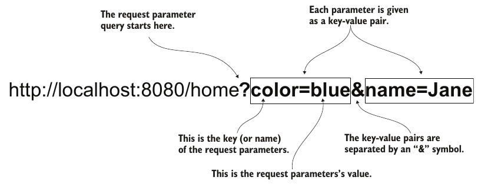

# Chapter 8: Implementing a Web App Using Spring MVC
- we can use spring MVC to implement both a web app that return a static view or a dynamic one

- A dynamic view has components and data that changes according to some state (for example data base state). Examples are the user name or profile picture of a user.

- These dynamic web pages use what we call a template engine that we will discuss later in this chapter

## Implementing static views

- To implement a static view we just need to implement a controller that returns the name of the view to render (in our case the view is a HTML document)

1. Create a class and annotate it with the `@Controller` annotation to declare it as a controller

1. Write a method (also known as a *action*) that implements the controller's functionality
1. Map the controller's action to a URL path and HTTP using the `@RequestMapping` annoation

```java
    @Controller
    public class MainController {
        @RequestMapping("/home")
        public String home() {
            return "home.html";
        }
    }
```

- The above code will return the `home.html` document as a response when a user sends a GET request to `domainName.com/home` using the browser 

- `@RequestMapping` is a general annoations for mapping a controller action to a path but to specify a HTTP method other that GET we need to pass extra parameters

- A shorter more specific way to do a mapping is to use annoations such as
    - `@GetMapping`
    - `@PostMapping`
    - etc...

## Recieving Data From the Client
- before discusssing how to impelement dynamic views, we will dicuss how can we recieve data form a request

### 1. Request parameters
- request parameters are data sent within the URL of the request 

- it should be used when the *data is not large* and the *data is optional*

- Request Prameters are sent as key value pair in the URL separated by `&`


- we retreive the request parameters by adding a parameter to the controller action and annotating it with `@RequestParam`
```java
    @Controller
    public class MainController {
        @RequestMapping("/home")
        public String home(@RequestParam String color) {
            return "home.html";
        }
    }
```
- The action parameter name must be the same as the request parameter key name 

- By default, request paramteres are mandatory. To make them optionin we use `@RequestParam(optional=true)` annoation 

### 2. Path variables

- Path variabls are a part of the path itself

- On the server side we must extract them from specific positions in the path
- Because they are a part of the path they are always mandatory and should only be used for always mandatory data
- Beacuase they are part of the data we should not have many path variables in our URL

- syntax:
    1. we give the variables a name and place them in curly braces in their positions in the path given to the annoatition used for mapping
    1. we pass to the action paramters with the same name as the path variable and annotate the aciton parameter with `@PathVariable`
    
```java
    @Controller
    public class MainController {
        @RequestMapping(/home/{color})
        public String home(@PathVariable String color) {
            return "home.html";
        }
    }
```

## Implementing Dynamic Views

### 1. The model

- to implement a dynamic view the controller must specify the view name as usual

- The extra thing is that the controller action will now take a `Model` parameter, fill it with data, and then send it to the view resolver in order for the view resolver to incorpirate the data into the view


```java
    @Controller
    public class MainController {
        @RequestMapping(/home)
        public String home(@RequestParam String color, Model page) {
            page.addAttribute("color", color)
            return "home.html";
        }
    }
```

### 2. Tempalte engine

- Now that we have the data in our Model we need to display them in a tempalte

- A common template engine is called Thymeleaf

- The below tempalte will display the color of the word "Hello" depending on the color sent to the web app as a request parameter as shown in the controller in section 1 

```HTML
<!-- home.html -->
<!-- this is the view who's name is returend by the controller action -->
<!DOCTYPE html>
    <html lang="en" xmlns:th="http://www.thymeleaf.org">
    <head>
        <meta charset="UTF-8">
        <title>Home Page</title>
    </head>
    <body>
        <h1>Hello
        <span th:style="'color:' + ${color}">World</span>!
        </h1>
    </body>
</html>
```

- note that for static HTML pages `home.html` is palced in `resources/static` directory but in case `home.html` is a thymeleaf template or another tempalate (such as JSP) then we should place it in `resources/tempaltes` directory