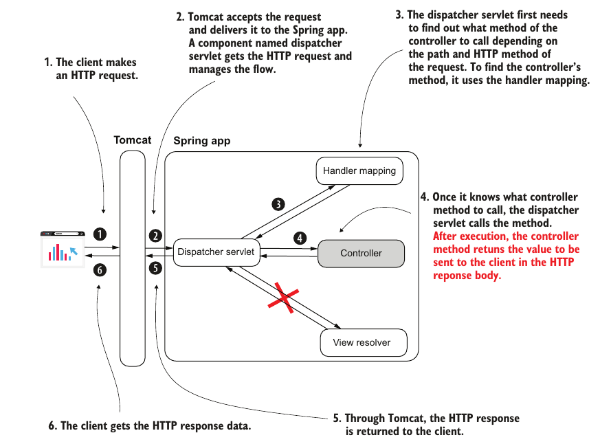

# Chapter 10: Implementing REST APIs

- Up until this point we have been using spring MVC to return web pages to the client

- Another opetion is to empliment an REST API that returns to the client raw data in the body of the response

- The main theme or feature we will be using is that when sending or recieveing an object in the HTTP:
    - Spring serializes the object to JSON when sending it back in the response body
    - Spring deserlizes JSON into an object when receving it in a request body

- we still use the components of the MVC architecture we used before except that we now don't need a viewResolver and we will be sending raw data back to the client


## How to implement a REST endpoint

### 1. Using `@ResponseBody` annotation

- we declare a controller and annotate each action that return raw data with `@ResponseBody`

```java
    @Controller
    public class HelloController{
        @GetMapping("/hello")
        @ResponseBody
        public string hello(){
            return "hello!";
        }
    }

    @GetMapping("/ciao")
    @ResponseBody
    public String ciao() {
        return "Ciao!";
    }
```

- writing @ResponeBody over and over is cumbersome so we use an alternative

### 2. using `@RestController`

- Instead of each action being annoated with @ResponseBody we annotate the entire controller class with `@RestController` to instruct that all actions of that class are REST endpoints

```java
    @RestController
    public class HelloController{
        @GetMapping("/hello")
        public string hello(){
            return "hello!";
        }
    }

    @GetMapping("/ciao")
    public String ciao() {
        return "Ciao!";
    }
```
## Dealing With The Response Body

### 1. Sendig objects as response body

when the action returns an object, Spring automatically serializes the object as a JSON

```java
    class Country{
        String name;
        String capital;
    }


    @RestComponent
    class example{
        @GetMappint("/france")
        public Country france(){
            Country c = new Country("france", "paris");

            return c;
        }
    }
```
- The above code will return a JSON with the following structure
```JSON
{
    "name": "france",
    "capital": "paris"
}
```

### 2. Setting the response header

- Sometimes we need to set the status HTTP header or add custom headers to the response

- This is done using the `ResponseEntity<>` generic

- It provides us with factory methods to build our response with ease

```java
@RestController
public class CountryController {
    @GetMapping("/france")
    public ResponseEntity<Country> france() {
        Country c = Country.of("france", "paris");
    
        return ResponseEntity
        .status(HttpStatus.ACCEPTED) //set response status
        .header("continent", "Europe") //adds custom header
        .header("capital", "Paris")
        .header("favorite_food", "cheese and wine")
        .body(c); //sets the respones body to the Country object c
    }
}
```

### 3. Recieving objects in request body

- To recieve an object from a request body we pass the object as a parameter to the action and annoatate it with `@RequestBody`

- By default, spring assumes that that the body is written in JSON and tries to crate an instance of the type of the parameter from the data in the JSON

- If spring cannot decode the body into the type specified (wrong JSON or the body is not even JSON) the app sends back a "Bad Request" status code

```java
    @RestController
    public class Example{

        @postMapping("/addCountry")
        public ResponseEntity<Country> addCountry (@RequestBody Country c){
            String text = "added country " + c.name + " with capital " + c.capital;
            
            return ResponseEntity
                    .status(HttpStatus.ACCEPTED)
                    .body(text);
        }
    }
```


## Handling Exception

- If a controller throws an exception, we can handle it using a `try` `catch` block within the controller itself

- Another option is to use a RestControllerAdvice

- Using Controller Advices for exception handling allows for
    - separating the happy flow from exception handling for separation of concerns and more redability
    - the reusage of exception handling logic in multiple locations without rewriting

- Controller advices may look like aspects but they are not because:
    - They do not form proxies around the controller
    - They are integrated within the MVC pipeline and can't be used on just any function

- When an excpetion occurs
    - spring will look for a catch block that handles the exception in the controller that threw it
    - it will then check all `@ControllerAdvice` classes
    - will use the first matching `@ExceptionHandler` method

- Controller advices are detected duriong componenet scan and places in special container in the context for later use

- Advices can also be used to change a response before it is returned and other stuff
- Example:

```java
    @RestControllerAdvice
    public class ExceptionControllerAdvice {

        @ExceptionHandler(NotEnoughMoneyException.class)
        public ResponseEntity<ErrorDetails> exceptionNotEnoughMoneyHandler() {
            ErrorDetails errorDetails = new ErrorDetails();
            errorDetails.setMessage("Not enough money to make the payment.");
            return ResponseEntity
                    .badRequest()
                    .body(errorDetails);
        }
    }
```
- The above controller advice will handle all rest controller that throw `NotEnoughMoneyException` 


