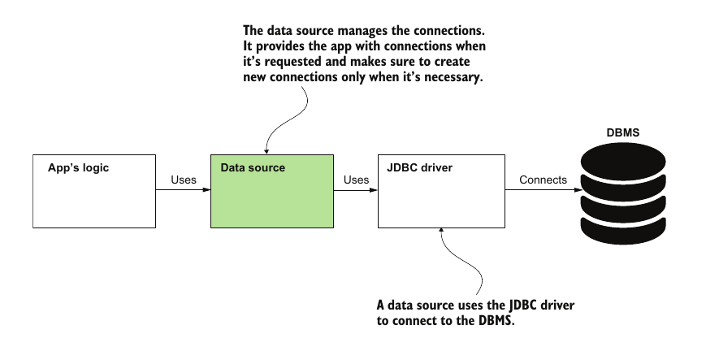

# Chapter 12: Starting with Persistance

## Data Sources

### 1. What is a data source
- A data source is a component between the data base and the app that manages connections to the database

- The data source's goal is to reuse connections to the database throught the application and to only create connections when necessary

- This is used because establishing a connection to the database is an expensive operation and so we try to reuse the connections as much as possible

- The technique we described above is also known as *Connection Pooling* and componenets providing such functionality are sometimes called *Connection Pools*


### 2. Default data source
- By default, spring boot configures HikariCP as the default data source for our application

- We don't need to request connections for the data source ourselves if we are not writing data access directly using the JDK JDBC inteface (such as when using jdbcTempalte)

### 3. Defining custom data sources 

- we might want to define multiple or custom data sources due to a couple of reasons such as:
    - having multiple data bases
    - wanting to initlize the source based on information only available at runtime
    - etc..
 - we do that through the configuraiton class 

    ```java
    @Configuration
    public class ProjectConfig {
        @Value("${custom.datasource.url}") //these values are retrieved from the project properties files
        private String datasourceUrl;
        @Value("${custom.datasource.username}")
        private String datasourceUsername;
        @Value("${custom.datasource.password}")
        private String datasourcePassword;

        @Bean
        public DataSource dataSource() {
            HikariDataSource dataSource = new HikariDataSource();
            dataSource.setJdbcUrl(datasourceUrl);
            dataSource.setUsername(datasourceUsername);
            dataSource.setPassword(datasourcePassword);
            dataSource.setConnectionTimeout(1000);
            return dataSource;
        }
    }
    ```
- `DataSource` is an interfae and `HikariDataSource` is an implementation to that interface

- By default spring uses the data found in `spring.datasource.` properties to initlize the data source without us explicity using these properties


## Using jdbcTemplate for persistance

- jdbcTempalte is a class that provides an abstraction over the JDK JDBC API to reduce boilerplate code required for interacting with a db

- The special thing about jdbcTempalte is that it requires an object called a RowMapper to put each row in a model object, the RowMapper is just a lamda specifying the mapping 

- Example showing the execution of a `SELECT` and mapping of rows

    ```java
    public list<Purchase> findPurchase(int purchaseID){
        String stmt = "SELECT * FROM purchase WHERE id = ?";

        RowMapper<Purchase> rowMapper = (r,i) -> { // r is the result set and i is the row number
            Purchase rowObject = new Purchase();
            rowObject.setId(r.getInt("id"));
            rowObject.setProduct(r.getString("product"));
            rowObject.setPrice(r.getBigDecimal("price"));
            return rowObject;
        }

        jdbc.query(stmt, new Object[]{purchaseID}, rowMapper)
    }
    ```

- There are "variations" on jdbcTemplate such as `namedParameterJdbcTempalte` that makes certain tasks like passing parameters even easier.