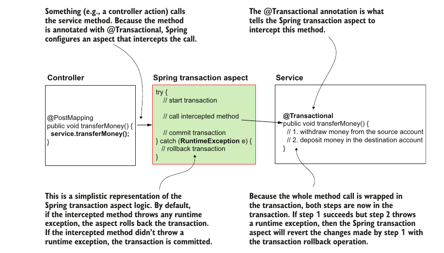

# Chapter 13: Transactions

## What is a Transaction

- A transaction in a DBMS is a represenatation of a single logical unit of work.

- It allows for correct recovery from failures and keeps the database consistent even in cases of system failure

- It allows for concurrent access to the database without which the result of an operation might not be correct

- A transaction by definition has the following properties:
    - atomic: it must be completed in its entirity or have no effect at all
    - consistent: it must conform to existent constraints in the database
    - isolated: it must no affect other transactions
    - durable: it must get written to persistant storage

- The above properties are usually acronymed into `ACID`

## How Spring Implements Transactions

- Transactions in spring are implemented as an aspect with pointcuts specified by `@Transactional`

- The implementation of the aspect is provided by spring. The aspect intercept the method, tries to execute it, and implements roll back in case there was any error.


- *VIP note: the aspect knows that it needs to roll back a transaction if the aspect's code throws an exception so catching the exception within the logic of the code doesn't propagates it to the aspect and so the aspect doesn't know that it should roll back and doesn't work properly*

## Example Implementation

- A common example is a bank transfer, in a bank transfer we must first deduce the ammount from the first account and then add to the second account

- Because there are two operations and an error occuring after the first one and stopping the second from executing would put the database in an incorrect state, we need to put them in a single atomic transaction

```java
@Repository
public class AccountRepository {
    private final JdbcTemplate jdbc;

    public AccountRepository(JdbcTemplate jdbc) {
        this.jdbc = jdbc;
    }

    public Account findAccountById(long id) {
        String sql = "SELECT * FROM account WHERE id = ?";
        return jdbc.queryForObject(sql, new AccountRowMapper(), id); //return an object of the type specified in the rowMapper
    }

    public void changeAmount(long id, BigDecimal amount) {
        String sql = "UPDATE account SET amount = ? WHERE id = ?";
        jdbc.update(sql, amount, id);
    }
}
 
```

```java
@Service
public class TransferService {
    private final AccountRepository accountRepository;

    public TransferService(AccountRepository accountRepository) {
        this.accountRepository = accountRepository;
    }

    @Transactional //this makse the method a transaction and note how we don't catch exception in this method 
    public void transferMoney(long idSender, long idReceiver, BigDecimal amount) {
        Account sender = accountRepository.findAccountById(idSender);
        Account receiver = accountRepository.findAccountById(idReceiver);
        BigDecimal senderNewAmount = sender.getAmount().subtract(amount);
        BigDecimal receiverNewAmount = receiver.getAmount().add(amount);
        //the following two transaction must be performed atomically
        accountRespository.changeAmount(idSender, senderNewAmount)
        accountRespository.changeAmount(idReceiver, receiverNewAmount)
    }
}
```