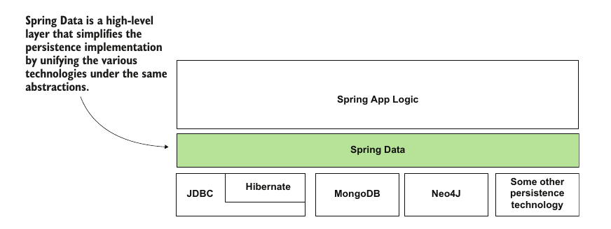
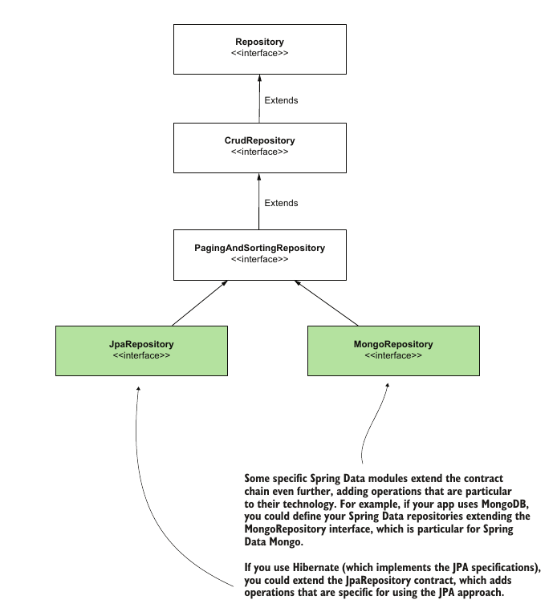

# Chapter 14: Spring Data

## What is Spring Data

- Spring Data refers to a familly of modules that aim to provide a unified interface for dealing with differnet underlying persistance technologies

- There is spring data for JDBC, JPA, mongoDB etc..

- It's goal is to write the persitance using the abstarctions provided which are common to various technologies

- Spring is responsible for providing the implementations to these interfaces

- We will be examining Spring Data JDBC in this chapter


## The Spring Data Hirearchy

- To follow the interface segragation principle, spring provides a hirarchy for interfaces each one extending the other and providing additional functionality on top of it

- This hirarachy is there to avoid having on big interface that has fucntionality we don't need

- The inteface looks as following and even has inteface that only work with certain underlying technologies such as Hibernate 


    - Respository: This interface is mainly used as a marker interface and extending it doesn't make spring implement any methods for us unless we specify these methods explicitly

    - CrudRepsitory: Spring provides an implementation for this interface, the implementations includes basic operations such as the finding item by primary key, updating records, etc

    - PagingAndSortingRepository: on top of the above provides implimentation for pagination capabilites and other advanced features

## Using Spring Data

- In all cases we only declare an interface that extend the Spring Data interfaces and some annotaions

- The interface hirarchy created by this is scanned by spring and when it finds that our interface extends one of the Spring Data interfaces it generates a class implementing the interface, creates an instance of that class and injects it for us when we want to use it 

- Spring data not only implements the methods of the interface, *it can also use our code and annotations to implement more functionality such as custom queries*

- Before anything Spring Data requires us to specify what the primary key of the object modelling the rows is
    ```java
    public class Account {
        @Id
        private long id;
        private String name;
        private BigDecimal amount;
        // Omitted getters and setters
    }
    ```

### 1. Using method naming conventions

- Spring can parse the name of methods in a Spring Data repository and construct a method based on predefined naming conventions

    ```java
    //the first object in generic is the object modelling the rows, the second is the datatype of the primary key
    public interface AccountRepository extends CrudRepository<Account, Long> {
        List<Account> findAccountsByName(String name);
    }
    ```

- Spring will parse the above method name and generate `SELECT * FROM account WHERE name = ?`

### 2. Using `@Query` annotation

- We can specify a custom query and bind it to a method as follows
    ```java
    public interface AccountRepository extends CrudRepository<Account, Long> {
        @Query("SELECT * FROM account WHERE name = :name")
        List<Account> findAccountsByName(String name);

        @Modifying
        @Query("UPDATE account SET amount = :amount WHERE id = :id")
        void changeAmount(long id, BigDecimal amount);
    }
    ```

- Query's that modify the database must be annotated with`@Query`

- The parameter names in the query should match the names of the parameters in the method signiture and no space should be between the parameter name and the `:` 

### 3. Using pre-implemented methods

- as we said before, spring provides implementations to the inteface.

- some predefined methods are
    - `deleteById(Id id)`
    - `findById(Id id)`
    - etc...

**We then proceed to inject the repsoitory we created and use the methods like normal methods et voila!**